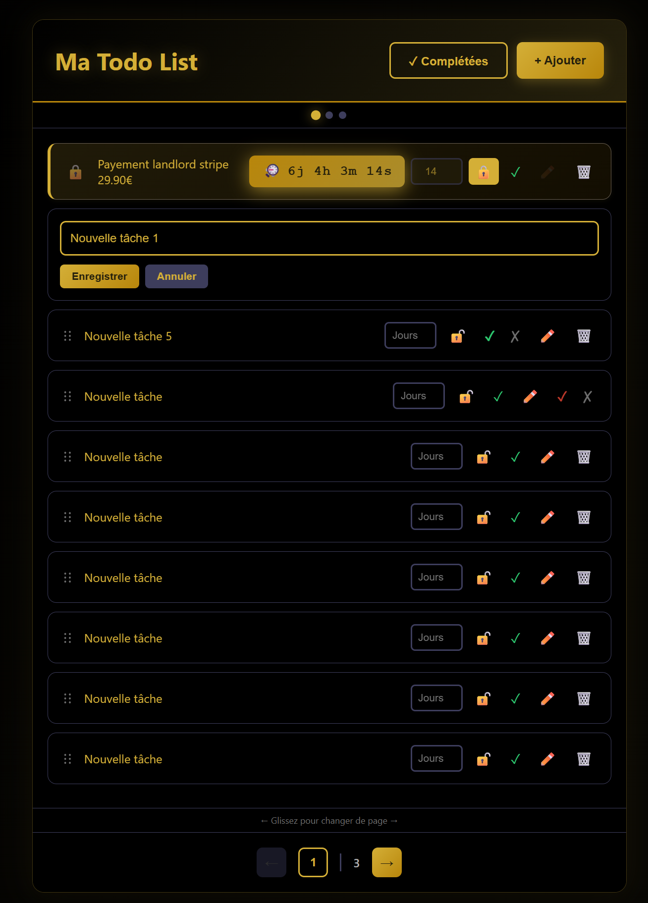

# To-Do List

Langage solicité:

- React - Vite
- Node.js
- Hono
- TypeScript
- Tailwind
- Postgres


# Objectif

- Test entretien to-do list avec claude ia

# Fonctionnalité

- Ajouter nouvelle tâche
- Editer tâche
- Supprimer & valider avec confirmation tâche
- Definir durée tâche
- Verrouiller tâche & demarre timer
- Déplacer une tache en la selectionnant
- Changer de page une tache en glissant vers un côté
- Changer de page avec button, input (renter numero de page), scroll sourie/pouce (tactile/mobile)
- Afficher tâche complété (par fin de timer ou bouton validation)
- Nombre de tâche adapter à la taille de l'écran


# Executer
*1-* Installation ```node_module``` :
- ```cd todo-back```
- ```yarn```
- ```cd todo-list```
- ```yarn```

*2-* Modifier ```.env``` selon vos paramètre serveur postgres (host, user, password).

*3-* Executer et création db:
- ```cd todo-back```
- ```yarn dev```
- ```cd todo-list```
- ```yarn dev```


# Aperçu

